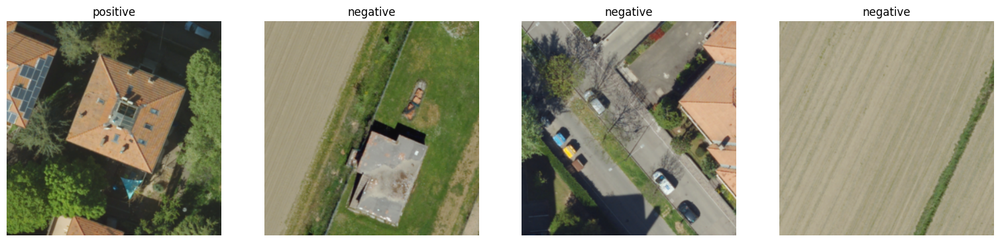
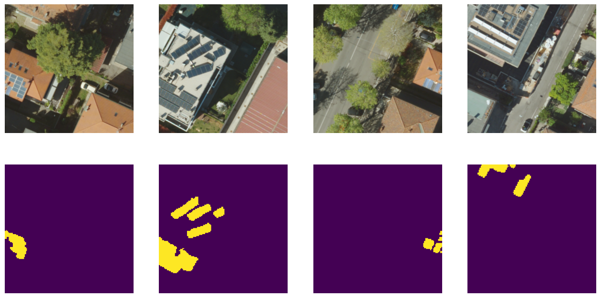

# Solar Panel Segmentation employing Deep Learning Techniques

### Introduction
This repository is a PyTorch implementation of a semantic segmentation pipeline applied to solar panel detection. 
- Preliminary classification: a classifier distinguishes "positive" images (containing solar panels) from "negative" images
  
- Semantic segmentation: a segmentation model generates segmentation masks of "positive" samples
    
We use torchvision EfficientNet-v2S for classification, SegFormer with MiT-b2 encoder for segmentation. We used these codes to fine-tune and evaluate these models on solar panel datasets.

### Usage
1. Clone repository
   ```shell
   git clone https://github.com/cozzalberto/segment_pvs.git
   ```
2. Train classifier with:
   
   - ```shell
     python tools/train_classifier.py
     ```
   
   - if you are using SLURM:
     ```shell
     sbatch tools/train_classifier.sh
     ```
     
We used SLURM to work with these models. Consequently, you may need to do minor changes to our code to be able to run it directly with `python`. 

3. Train segmentation model:
   
   - ```shell
     python tools/train_segformer.py
     ```
   
   - if you are using SLURM:
     ```shell
     sbatch tools/train_segformer.sh
     ```
   

5. Test:
   1. Classify your test set images into "positive" or "negative":
      
     ```shell
     sbatch tools/classify.sh
     ```
   
   2. Segment the images predicted to contain solar panels:
      
     ```shell
     sbatch tools/segment.sh
     ```
   Trained model checkpoints are provided at https://drive.google.com/drive/folders/1_B-l3AS1mgYD6Sc0ihTxMQkfW7owiHbW?usp=sharing 
   If you have access to a labeled test set we provide also `test.py` and `test_segment.py` that compute accuracy metrics of classifier and segmentation model, respectively.
